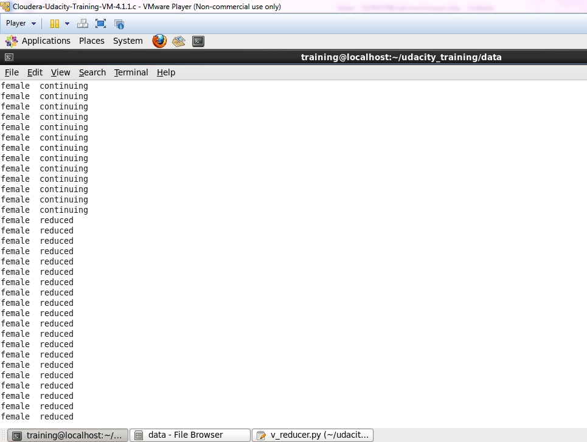
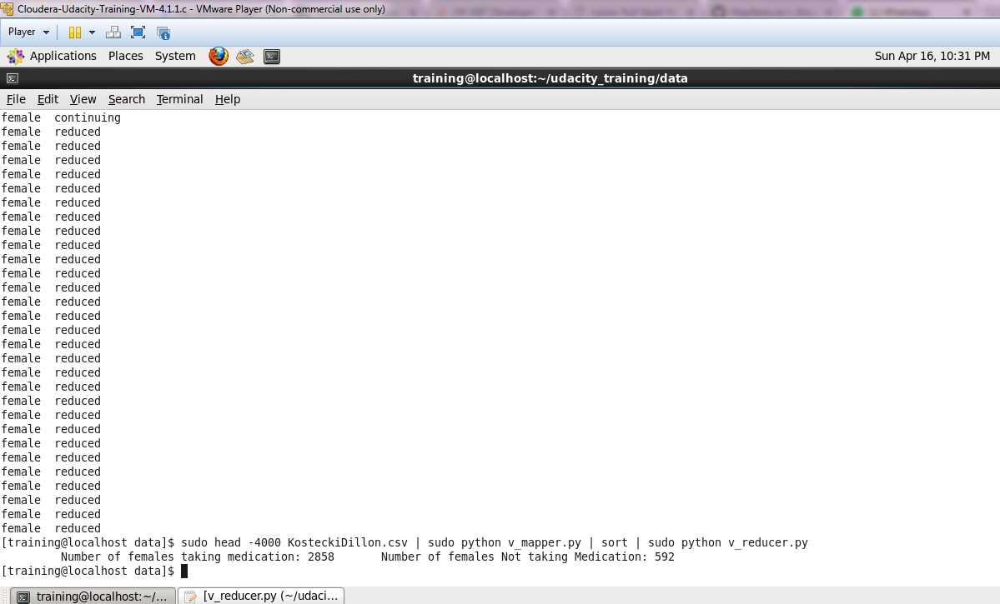
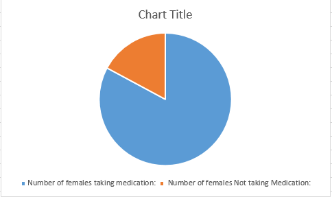

# MapReduce

About the project:
The project is to develop a map-reduce solution. In our project we are trying to find out map – reduce solution for how many age groups of people both genders suffering from migraine and the symptoms and medication they are using based on the dataset. Our dataset is a subset of data on migraine treatments collected by Tammy Kostecki-Dillon.
The data set consist of headache logs kept by 133 patients in a treatment program in which bio-feedback was used to attempt to reduce migraine frequency and severity.

Getting Started :
In order to see the code the following steps need to be followed

Prerequisites

The prerequisite is to have a VMware , Python installed and running in laptop.

Link to download VMWare

Download and install from https://my.vmware.com/web/vmware/free#desktop_end_user_computing/vmware_player/6_0

or

Download and install VirtualBox from https://www.virtualbox.org/wiki/Downloads

Link to download Python 2.6 version

https://www.python.org/download/releases/2.6.6/

Create the Virtual Machine:	

###Installion of VMWare Download the VMWare from above link and then install by these steps Create a new Virtual machine: Create a new virtual machine by pressing the ‘New’ button: Choose a name, use ‘Type’: ‘Linux’: Press Next Select memory size for the VM. (2048 MB) Press Next Select ‘Use an existing virtual hard drive file’’, click the button to browse to the directory you unzipped the provided VM image and press ‘Create’. Select the machine and click ‘Play virtual machine’ Start the VM!

How to run the solution

After installing VMWare put the mapper, reducer and .csv dataset into a folder and follow the commands given below in order to put these files into HDFS and run the solution to get the output

In code, to see local mapper.py & reducer.py, type:

$ ls

$ ls ../data

$ cd ../data

Put a copy of KosteckiDillon.csv into HDFS myinput directory.

$ hadoop fs -ls

$ hadoop fs -put KosteckiDillon.csv

$ hadoop fs -ls

$ hadoop fs -tail KosteckiDillon.csv

$ hadoop fs -mv KosteckiDillon.csv newname.txt

$ hadoop fs -rm newname.txt

$ hadoop fs -mkdir myinput

$ hadoop fs -put KosteckiDillon.csv myinput

Verify myinput/KosteckiDillon.csv is in HDFS.

$ hadoop fs -ls myinput 

To Run MR

hs s_mapper.py s_reducer.py myinput joboutput

Review the output in HDFS

$ hadoop fs -ls

$ hadoop fs -ls joboutput

To get results out of hadoop, use get:

$ hadoop fs -get joboutput/part-00000 results.txt

Check for a local copy with ls:

$ ls 

s_mapper.py s_reducer.py results.txt

Data and Citations :

Data is taken from https://vincentarelbundock.github.io/Rdatasets/datasets.html
References seen for data streaming command fail error 
http://stackoverflow.com/questions/15302262/hadoop-streaming-command-failure-with-python-error
http://stackoverflow.com/questions/27451984/hadoop-streaming-command-failed-job-not-successful
http://stackoverflow.com/questions/25466296/hadoop-streaming-command-failed

Mapper Output :

Reducer Output :

MapReduce Output :

